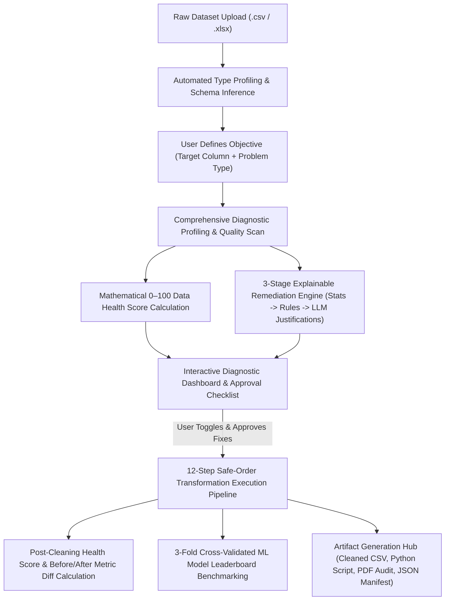
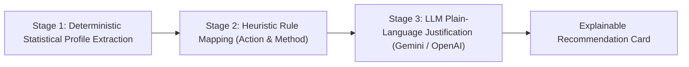
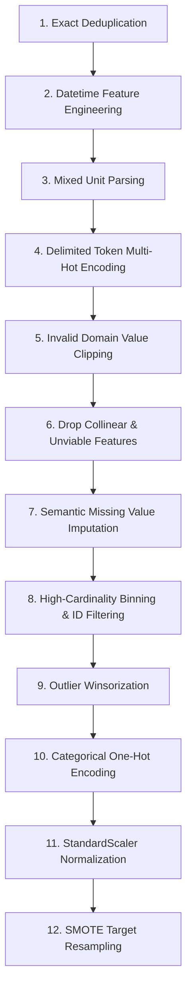

# 🛡️ AI Data Readiness Platform (AegisMind Engine)

> **An Explainable Pre-Machine Learning Diagnostic, Automated Remediation & Model Benchmarking Platform**  
> *Bridging the critical gap between raw, messy data and robust, production-grade machine learning models.*

---

## 📑 Table of Contents

1. [Executive Overview](#-executive-overview)
2. [End-to-End System Architecture & Execution Lifecycle](#-end-to-end-system-architecture--execution-lifecycle)
3. [Mathematical Foundations & 0–100 Data Health Score](#-mathematical-foundations--0100-data-health-score)
4. [Diagnostic & Quality Detection Suite](#-diagnostic--quality-detection-suite)
5. [3-Stage Explainable AI Recommendation Engine](#-3-stage-explainable-ai-recommendation-engine)
6. [Safe-Order 12-Step Transformation Execution Engine](#-safe-order-12-step-transformation-execution-engine)
7. [Cross-Validation & Model Benchmarking Engine](#-cross-validation--model-benchmarking-engine)
8. [Export Hub & Reproducible Artifact Generation](#-export-hub--reproducible-artifact-generation)
9. [Project Directory & File Structure](#-project-directory--file-structure)
10. [REST API Data Contracts & Endpoint Reference](#-rest-api-data-contracts--endpoint-reference)
11. [Installation & Local Setup Guide](#-installation--local-setup-guide)

---

## 📌 Executive Overview

Most modern AutoML frameworks attempt to solve: **"Which algorithm or hyperparameter configuration gives the highest test accuracy?"**

However, in real-world data science, **garbage in equals garbage out**. Real datasets suffer from missingness, exact duplicate rows, extreme outliers, unparsed datetime strings, mixed measurement units, severe class imbalance, high-cardinality IDs, and multicollinearity. 

The **AI Data Readiness Platform** solves the prerequisite question:  
👉 **"Is this dataset statistically viable for machine learning, what specific defects exist, why do they matter, and how can we safely transform it?"**

### Core Principles
* **100% Explainable & Grounded:** Every recommendation is computed with statistical heuristics and justified using LLM explanations (Gemini / OpenAI) with deterministic fallback templates.
* **Human-in-the-Loop Governance:** Destructive operations (dropping columns, dropping rows) are never executed without explicit user opt-in.
* **Mathematical Sequence Integrity:** Transformations run in a mathematically safe order to avoid data leakage and distorted statistics.
* **Full Pipeline Reproducibility:** Generates standalone Python/Scikit-Learn pipeline scripts, executive PDF audit reports, and model-ready cleaned CSVs.

---

## 🏗️ End-to-End System Architecture & Execution Lifecycle



---

## 🧮 Mathematical Foundations & 0–100 Data Health Score

The platform computes a **0–100 composite Data Health Score** ($S_{\text{composite}}$) along with 6 individual sub-scores that quantify data readiness.

```math
S_{\text{composite}} = \sum_{i=1}^{6} w_i \cdot S_i
$$
```

Where the weights $w_i$ and sub-scores $S_i$ are mathematically defined as follows:

| Sub-Score Dimension ($S_i$) | Weight ($w_i$) | Mathematical Formula & Penalties | Thresholds & Risk Criteria |
| :--- | :---: | :--- | :--- |
| **1. Missingness Score** | **25%** ($0.25$) | $S_{\text{miss}} = \max\left(0, 100 - (\text{overall\_missing\_pct} \times 2.5)\right)$ | Penalizes total missing values. $>40\%$ missing reduces sub-score to $0$. |
| **2. Duplication Score** | **15%** ($0.15$) | $S_{\text{dup}} = \max\left(0, 100 - (\text{duplicate\_rows\_pct} \times 5.0)\right)$ | $>20\%$ duplicate rows reduces sub-score to $0$ to prevent severe train-test leakage. |
| **3. Outlier Score** | **15%** ($0.15$) | $S_{\text{out}} = \max\left(0, 100 - (\overline{\text{outlier\_pct}} \times 3.0 + N_{\text{outlier\_cols}} \times 4.0)\right)$ | Evaluates percentage of extreme points beyond $1.5 \times \text{IQR}$ across numeric columns. |
| **4. Domain Validity Score** | **15%** ($0.15$) | $S_{\text{val}} = \max\left(0, 100 - (N_{\text{invalid\_cols}} \times 20.0)\right)$ | Penalizes negative values in strictly non-negative columns (age, salary, price, count). |
| **5. Target Balance Score** | **15%** ($0.15$) | $S_{\text{bal}} = \max\left(0, 100 - (\text{majority\_ratio} - 0.5) \times 160.0\right)$ | For classification: $50:50 \rightarrow 100$, $95:5 \rightarrow 28$, $100:0 \rightarrow 20$. Defaults to $100.0$ for regression. |
| **6. Feature Quality Score** | **15%** ($0.15$) | $S_{\text{feat}} = \max\left(0, 100 - (N_{\text{collinear\_pairs}} \times 10.0 + N_{\text{constant\_cols}} \times 15.0)\right)$ | Penalizes features with Pearson correlation $\|r\| > 0.85$ or near-zero variance ($\sigma^2 = 0$). |

### Letter Grade Classifications
* **`A (90–100)` — Excellent Readiness:** Data is model-ready with negligible defects.
* **`B (80–89.9)` — Good Readiness:** Minor missingness or mild outliers present; standard pipelines will converge.
* **`C (70–79.9)` — Fair (Needs Cleaning):** Moderate data quality defects that risk degrading gradient steps or accuracy.
* **`D (60–69.9)` — Poor (High Risk):** Significant data leaks, heavy duplication, or severe multicollinearity.
* **`F (<60)` — Critical Quality Defects:** Unusable without structural remediation.

---

## 🔍 Diagnostic & Quality Detection Suite

The detector module ([`detector.py`](file:///c:/Users/Arif%20Choudhary/OneDrive/Desktop/Major%20project/backend/app/engine/detector.py)) runs a multi-pass statistical scan:

### 1. Inferred Column Type Classification
Each column is dynamically categorized into one of 6 semantic types:
* **`numeric`**: Float or integer series with $>10$ unique numeric values.
* **`categorical`**: Strings or low-cardinality integers ($\le 20$ unique categories).
* **`boolean`**: Binary values (`{0, 1}`, `{'True', 'False'}`, `{'Yes', 'No'}`).
* **`datetime`**: Dates matching standard ISO, timestamp, or slash formats.
* **`id`**: Unique identifier columns (cardinality ratio $>0.98$ on string/integer series).
* **`text`**: High-cardinality natural language or unformatted token sequences.

### 2. Detection Algorithms & Heuristics

* **Missing Values**:
  * $\text{Missing Pct} > 50\%$ $\rightarrow$ Severity: **Critical** (Suggests feature elimination).
  * $20\% < \text{Missing Pct} \le 50\%$ $\rightarrow$ Severity: **High** (Suggests advanced imputation or indicator flag).
  * $0\% < \text{Missing Pct} \le 20\%$ $\rightarrow$ Severity: **Medium** (Suggests median/mode imputation).
* **Exact Duplicate Rows**:
  * Computes exact hash equality across all features using Pandas `df.duplicated()`.
* **Statistical Outliers (Tukey's Fences)**:
  * Lower Bound: $Q_1 - 1.5 \times \text{IQR}$
  * Upper Bound: $Q_3 + 1.5 \times \text{IQR}$
  * *Smart Filtering:* Skips columns representing calendar years, IDs, or columns with skewness $\approx 0$.
* **Domain Validity & Mixed Units**:
  * Detects negative numbers in non-negative keyword columns (`age`, `salary`, `income`, `price`, `cost`, `revenue`, `distance`, `fare`, `tenure`).
  * Detects mixed unit strings (e.g. `"90 min"`, `"2 Seasons"`, `"120 km/h"`).
* **Multicollinearity**:
  * Computes the Pearson Correlation Matrix $R$. Any pair $(X_i, X_j)$ where $\|r_{ij}\| > 0.85$ triggers a collinearity warning.
* **Class Imbalance**:
  * For classification targets, computes the majority class percentage. Flags imbalances exceeding $70\%:30\%$.

---

## 🧠 3-Stage Explainable AI Recommendation Engine



### Stage 1: Deterministic Statistical Profiling
Gathers raw column metrics: distribution skewness $\gamma_1$, missingness percentage, cardinality, variance, min, max, and correlation.

### Stage 2: Heuristic Rule Mapping ([`rules.py`](file:///c:/Users/Arif%20Choudhary/OneDrive/Desktop/Major%20project/backend/app/engine/rules.py))
Maps detected issues to standard Scikit-Learn remediation transformations:
* High Missingness ($>50\%$) $\rightarrow$ `Drop Redundant / High-Missingness Feature`
* Continuous Numeric Missingness $\rightarrow$ `Median Imputation (Skewed)` or `Mean Imputation (Normal)`
* Categorical Missingness $\rightarrow$ `Mode Imputation` or `Constant Fill ('Unknown')`
* Extreme Outliers $\rightarrow$ `IQR Winsorization / Capping (1.5x IQR)`
* Non-Negative Domain Breach $\rightarrow$ `Zero-Clipping Transformation`
* Collinear Pair $\rightarrow$ `Drop Redundant Collinear Feature`
* High-Cardinality Categoricals $\rightarrow$ `Frequency / Target Encoding` or `Drop High-Cardinality ID`

### Stage 3: Generative AI Justification ([`explainer.py`](file:///c:/Users/Arif%20Choudhary/OneDrive/Desktop/Major%20project/backend/app/engine/explainer.py))
The system feeds the exact statistical parameters into an LLM (Google Gemini or OpenAI) to generate a high-clarity explanation answering:
1. *Why does this defect degrade machine learning models?*
2. *Why is this specific remediation algorithm the mathematically optimal choice?*
3. *What is the exact impact on variance, bias, and inference?*

> **Zero-Failure Fallback:** If API keys are missing or the network fails, the system seamlessly uses deterministic, high-accuracy statistical fallback templates so execution never halts.

---

## ⚙️ Safe-Order 12-Step Transformation Execution Engine

When the user clicks **"Apply Fixes & Verify"**, transformations are applied in an immutable, mathematically safe order ([`executor.py`](file:///c:/Users/Arif%20Choudhary/OneDrive/Desktop/Major%20project/backend/app/engine/executor.py)):



### Why Execution Order Matters:
1. **Deduplication First:** Prevents duplicate rows from distorting column medians, means, and standard deviations.
2. **Datetime & Units Extracted Early:** Allows newly generated continuous features (e.g. `release_year`, `duration_minutes`) to participate in downstream imputation and scaling.
3. **Dropping Features Before Imputation:** Avoids wasting compute power estimating values for columns destined to be removed.
4. **Imputation Before Winsorization:** Ensures quantile computations ($Q_1, Q_3$) operate on full arrays without NaN pollution.
5. **Encoding Before Scaling:** Converts categorical strings to binary columns so that numerical scaling normalizes all active inputs uniformly.
6. **Resampling (SMOTE) Last:** Ensures synthetic minority oversampling occurs only on fully encoded, imputed, and scaled matrices.

---

## 🏆 Cross-Validation & Model Benchmarking Engine

Once the dataset is transformed, the platform automatically trains and benchmarks an ensemble of candidate algorithms ([`benchmark.py`](file:///c:/Users/Arif%20Choudhary/OneDrive/Desktop/Major%20project/backend/app/engine/benchmark.py)).

### Cross-Validation Strategy

#### 1. Classification Problems
* **Validation Method:** **`StratifiedKFold(n_splits=3, shuffle=True, random_state=42)`**
* **Scoring Metric:** **Macro F1-Score** (`make_scorer(f1_score, average="macro", zero_division=0)`)
* **Purpose:** Preserves exact class balance ratios across training and test splits to guard against misleading accuracy in imbalanced scenarios.

#### 2. Regression Problems
* **Validation Method:** **`KFold(n_splits=3, shuffle=True, random_state=42)`**
* **Scoring Metric:** **$R^2$ Score (Coefficient of Determination)** (`make_scorer(r2_score)`)
* **Purpose:** Evaluates variance explanation across independent folds without distributional bias.

### Benchmarked Model Pool

```
┌──────────────────────────────────────────────┬──────────────────────────────────────────────┐
│ Classification Candidate Models              │ Regression Candidate Models                  │
├──────────────────────────────────────────────┼──────────────────────────────────────────────┤
│ • Random Forest Classifier (25 estimators)   │ • Random Forest Regressor (25 estimators)    │
│ • XGBoost Classifier (if available)          │ • XGBoost Regressor (if available)           │
│ • LightGBM Classifier (if available)         │ • LightGBM Regressor (if available)          │
│ • Gradient Boosting Classifier               │ • Gradient Boosting Regressor                │
│ • Logistic Regression (L2 Regularized)       │ • Ridge Regression (L2 Regularized)          │
│ • Decision Tree Classifier (Max Depth = 5)   │ • Decision Tree Regressor (Max Depth = 5)    │
│ • Support Vector Machine (RBF Kernel)        │ • Support Vector Regressor (SVR RBF Kernel)  │
└──────────────────────────────────────────────┴──────────────────────────────────────────────┘
```

The output yields a ranked **Leaderboard** detailing:
* Model Rank & Name
* Cross-Validated Score ($\text{Macro F1}$ or $R^2$)
* Training Execution Latency ($\text{seconds}$)
* Suitability Rating (`High` / `Moderate` / `Low`)
* Architectural Description & Rationale

---

## 📦 Export Hub & Reproducible Artifact Generation

Upon execution, the engine compiles 4 production-grade export artifacts:

1. **Cleaned Dataset (`.csv`):** Fully sanitized, transformed, and model-ready tabular file.
2. **Standalone Python Pipeline Script (`.py`):** Self-contained, executable Scikit-Learn script containing the exact sequence of transformations for local integration or CI/CD pipelines.
3. **Executive PDF Audit Report (`.pdf`):** Formal ReportLab-generated audit document with Data Health Score dials, issue breakdowns, before/after metric deltas, and model recommendations.
4. **Machine-Readable JSON Manifest (`.json`):** Full telemetry metadata containing column profiles, statistical issues, applied remediation rules, and benchmarking leaderboards.

---

## 📂 Project Directory & File Structure

```
Major project/
├── backend/                               # FastAPI Python Backend
│   ├── app/
│   │   ├── core/
│   │   │   └── config.py                  # Environment settings, CORS, LLM API keys
│   │   ├── engine/                        # Core Data Intelligence Engines
│   │   │   ├── profiler.py                # Type inference & summary statistics
│   │   │   ├── detector.py                # Multi-pass data defect detection
│   │   │   ├── scorer.py                  # 0–100 Data Health Score algorithm
│   │   │   ├── rules.py                   # Heuristic recommendation generator
│   │   │   ├── explainer.py               # AI justifications (Gemini / OpenAI)
│   │   │   ├── executor.py                # 12-Step safe-order transformation pipeline
│   │   │   ├── benchmark.py               # 3-Fold cross-validation model evaluator
│   │   │   └── reporter.py                # PDF ReportLab generator
│   │   ├── routers/                       # REST API Route Controllers
│   │   │   ├── ingestion.py               # File upload & profile endpoints
│   │   │   ├── diagnosis.py               # Objective & health diagnosis
│   │   │   ├── remediation.py             # Transformation pipeline execution
│   │   │   └── export.py                  # Download & artifact endpoints
│   │   └── main.py                        # FastAPI application entrypoint
│   ├── storage/                           # Ingested datasets & export artifacts
│   ├── requirements.txt                   # Python dependencies
│   └── .env                               # Environment configurations
│
├── frontend/                              # Next.js Turborepo Workspace
│   ├── apps/
│   │   ├── dashboard/                     # Main Application UI
│   │   │   └── src/
│   │   │       ├── app/                   # App Router pages & global styles
│   │   │       │   ├── page.tsx           # Step-by-step diagnostic workflow
│   │   │       │   └── globals.css        # Design tokens & modern light theme
│   │   │       ├── components/            # UI Components
│   │   │       │   ├── Header.tsx         # Platform navbar & dataset indicator
│   │   │       │   ├── Stepper.tsx        # 5-stage progress indicator
│   │   │       │   ├── UploadStep.tsx     # Drag-and-drop ingestion zone
│   │   │       │   ├── ObjectiveStep.tsx  # Target column & problem selector
│   │   │       │   ├── HealthScoreGauge.tsx # Radial SVG health score meter
│   │   │       │   ├── ProfileTable.tsx   # Feature profiling matrix table
│   │   │       │   ├── RecommendationChecklist.tsx # Explainable fix approvals
│   │   │       │   ├── BeforeAfterDiff.tsx # Before vs after delta comparison
│   │   │       │   ├── ModelLeaderboard.tsx # Ranked ML model benchmark cards
│   │   │       │   └── ExportHub.tsx      # Artifact download hub
│   │   │       └── services/
│   │   │           └── api.ts             # Axios API client & data interfaces
│   │   └── landing/                       # Product Landing & Feature Showcase
│   ├── package.json                       # Turborepo root configuration
│   └── turbo.json                         # Turborepo pipeline caching
│
└── README.md                              # Complete System Documentation
```

---

## 🔌 REST API Data Contracts & Endpoint Reference

### Base URL: `http://localhost:8000/api/v1`

| Method | Endpoint | Description | Request Payload / Params | Response Payload |
| :--- | :--- | :--- | :--- | :--- |
| `POST` | `/datasets/upload` | Ingest raw CSV or Excel dataset | `multipart/form-data` (`file`) | `DatasetSummary` (ID, rows, cols, preview sample) |
| `POST` | `/diagnose` | Run full diagnostic profiling & AI fixes | `{"dataset_id": "...", "problem_type": "...", "target_column": "..."}` | `DiagnosticResponse` (Profile, Health Score, Recommendations) |
| `POST` | `/execute` | Run safe-order cleaning & benchmarking | `{"dataset_id": "...", "approved_recommendation_ids": [...]}` | `ExecutionResult` (Before/After Score, Leaderboard, Deltas) |
| `GET` | `/export/csv/{dataset_id}` | Download model-ready CSV | Path Parameter: `dataset_id` | File download (`.csv`) |
| `GET` | `/export/pipeline/{dataset_id}`| Download standalone Python code | Path Parameter: `dataset_id` | File download (`.py`) |
| `GET` | `/export/pdf/{dataset_id}` | Download executive PDF audit | Path Parameter: `dataset_id` | File download (`.pdf`) |
| `GET` | `/export/manifest/{dataset_id}`| Download machine-readable manifest | Path Parameter: `dataset_id` | JSON payload (`manifest.json`) |

---

## 🚀 Installation & Local Setup Guide

### Prerequisites
* **Python 3.10+** (Python 3.11 recommended)
* **Node.js 18+** & **npm 9+**
* Optional: Gemini API Key (`GEMINI_API_KEY`) or OpenAI API Key (`OPENAI_API_KEY`)

---

### Step 1: Backend Setup

1. Open terminal and navigate to the backend directory:
   ```bash
   cd backend
   ```

2. Create and activate a Python virtual environment:
   ```bash
   # Windows (PowerShell)
   python -m venv venv
   .\venv\Scripts\Activate.ps1

   # macOS / Linux
   python3 -m venv venv
   source venv/bin/activate
   ```

3. Install required Python packages:
   ```bash
   pip install -r requirements.txt
   ```

4. Configure your `.env` file in the `backend/` folder:
   ```env
   PROJECT_NAME="AI Data Readiness Platform"
   API_V1_STR="/api/v1"
   BACKEND_CORS_ORIGINS=["http://localhost:3000","http://localhost:3001"]

   # Optional: AI Reasoning API Keys (Defaults to statistical template fallback if omitted)
   GEMINI_API_KEY="your-gemini-api-key-here"
   OPENAI_API_KEY=""
   ```

5. Start the FastAPI backend server:
   ```bash
   uvicorn app.main:app --reload --port 8000
   ```
   * *Swagger API Interactive Docs:* [http://localhost:8000/docs](http://localhost:8000/docs)
   * *API Health Check:* [http://localhost:8000/health](http://localhost:8000/health)

---

### Step 2: Frontend Setup

1. Open a new terminal and navigate to the frontend directory:
   ```bash
   cd frontend
   ```

2. Install Node dependencies:
   ```bash
   npm install
   ```

3. Start the Next.js development server:
   ```bash
   # Start all applications via Turborepo
   npm run dev

   # Or run dashboard directly
   npm run dev:dashboard
   ```

4. Open your browser and navigate to:
   * **Dashboard Application:** [http://localhost:3000](http://localhost:3000) (or port displayed in terminal)
   * **Landing Page:** [http://localhost:3001](http://localhost:3001)

---

## 🛡️ License

This project is licensed under the **MIT License**.
